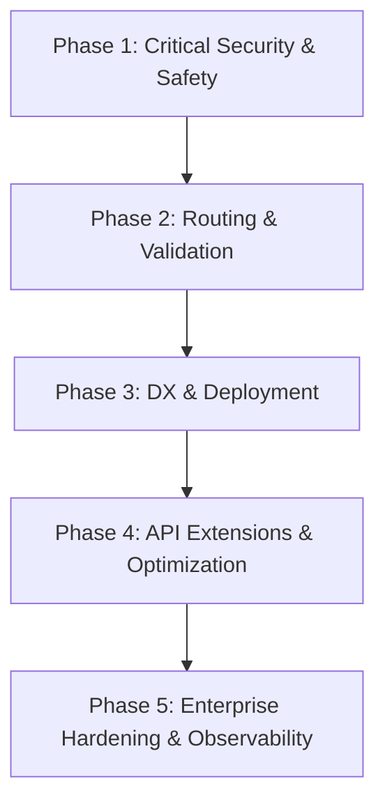

# API Boilerplate — Gap Resolution Plan (5-Phase Roadmap)

This document outlines the step-by-step plan to address the 20 gaps identified in the API
Boilerplate Gap Analysis. The tasks are distributed across 5 sequential phases, moving from critical
security fixes to advanced enterprise features.

---

## 🗺️ Roadmap Overview

---

## 📌 Phase 1: Critical Security & Safety Fixes

_Focuses on immediate vulnerabilities that could compromise the application in production._

### 1. Fix `Math.random()` in `OTPGenerator`

- **Difficulty**: Easy
- **Security Risk**: Medium-High
- **Description**: Replace `Math.random()` in the OTP utility with Node's cryptographically secure
  `crypto.randomInt()`.
- **Target File**: [app.helpers.ts](file:///f:/boilerplate/api/src/core/helpers/app.helpers.ts)

### 2. Rate Limiting / Throttling

- **Difficulty**: Medium
- **Security Risk**: Critical (Brute-force risk)
- **Description**: Configure `@nestjs/throttler` in `app.module.ts`. Protect sensitive endpoints
  (magic-link requests, login verification) with rate limiting rules.
- **Target Files**:
  - [app.module.ts](file:///f:/boilerplate/api/src/app.module.ts)
  - [throttler.guard.ts](file:///f:/boilerplate/api/src/core/guards/throttler.guard.ts)

### 3. CORS Methods Configuration

- **Difficulty**: Easy
- **Security/Compatibility Risk**: Low
- **Description**: Explicitly allow standard `HEAD` and `OPTIONS` HTTP methods in the CORS
  configuration to avoid issues with preflight requests.
- **Target File**: [main.ts](file:///f:/boilerplate/api/src/main.ts)

---

## 📌 Phase 2: Routing & Validation Infrastructure

_Focuses on stabilizing incoming request processing, validation, and tracing._

### 4. Request ID Propagation Middleware

- **Difficulty**: Easy
- **Observability Risk**: High
- **Description**: Set up middleware that intercepts incoming requests, extracts or generates a
  unique `X-Request-Id` UUID, assigns it to the request context, and appends it to response headers.
- **Target Files**:
  - [NEW]
    [request-id.middleware.ts](file:///f:/boilerplate/api/src/core/middlewares/request-id.middleware.ts)
  - [main.ts](file:///f:/boilerplate/api/src/main.ts)

### 5. Global Validation Pipe

- **Difficulty**: Medium
- **Reliability Risk**: High
- **Description**: Set up a global Zod validation pipe in NestJS to enforce body schema validation
  automatically and strip unregistered fields, ensuring handlers only process sanitized inputs.
- **Target File**: [main.ts](file:///f:/boilerplate/api/src/main.ts)

### 6. Conditional Environment Validation

- **Difficulty**: Easy
- **DX Friction**: Medium
- **Description**: Make third-party integration variables (`CLOUDINARY_*`, `BREVO_*`, `GOOGLE_*`)
  optional at startup using Zod `.optional()` so local execution doesn't block developers.
- **Target File**: [env.ts](file:///f:/boilerplate/api/src/core/validators/env.ts)

### 7. Audit `.env.example`

- **Difficulty**: Easy
- **DX Friction**: Low
- **Description**: Sync and complete `.env.example` with comments explaining all variables,
  including database configuration variables used by Docker Compose.
- **Target File**: [.env.example](file:///f:/boilerplate/api/.env.example)

---

## 📌 Phase 3: DX, API Documentation & Deployment Foundation

_Improves API container execution, and deployment orchestration._

### 8. API Documentation (Swagger / OpenAPI)

- **Difficulty**: Medium
- **DX Friction**: Critical
- **Description**: Integrate `@nestjs/swagger`, configure inside `main.ts` with a dedicated `/docs`
  route, and add OpenAPI tags/descriptions to core routes.
- **Target Files**:
  - [main.ts](file:///f:/boilerplate/api/src/main.ts)
  - [package.json](file:///f:/boilerplate/api/package.json)

### 9. Health Check Endpoint (`/health`)

- **Difficulty**: Medium
- **Infrastructure Risk**: High
- **Description**: Implement a health check module using NestJS Terminus, checking DB connectivity
  and key process metrics.
- **Target Files**:
  - [NEW] [health.module.ts](file:///f:/boilerplate/api/src/app/health/health.module.ts)
  - [NEW] [health.controller.ts](file:///f:/boilerplate/api/src/app/health/health.controller.ts)

### 10. Docker Setup Completeness

- **Difficulty**: Medium
- **Infrastructure Risk**: Medium
- **Description**: Add a multi-stage production-ready `Dockerfile` and update `docker-compose.yml`
  to support the app container, caching database (Redis), and db health checks.
- **Target Files**:
  - [NEW] [Dockerfile](file:///f:/boilerplate/api/Dockerfile)
  - [docker-compose.yml](file:///f:/boilerplate/api/docker-compose.yml)

---

## 📌 Phase 4: API Extensions & Optimizations

_Extends core product behavior, performance, and communication._

### 11. Media Listing Pagination

- **Difficulty**: Medium
- **Performance Risk**: Medium
- **Description**: Add offset/limit or cursor query parameters on the media endpoint, limiting media
  fetches and preventing memory overload.
- **Target Files**:
  - [media.controller.ts](file:///f:/boilerplate/api/src/app/media/media.controller.ts)
  - [media.service.ts](file:///f:/boilerplate/api/src/app/media/media.service.ts)

### 12. Single User Admin Fetch (`GET /users/:id`)

- **Difficulty**: Medium
- **API Completeness**: Medium
- **Description**: Add a retrieval route for individual user details by admin, validating
  permissions.
- **Target Files**:
  - [users.controller.ts](file:///f:/boilerplate/api/src/app/users/users.controller.ts)
  - [users.service.ts](file:///f:/boilerplate/api/src/app/users/users.service.ts)

### 13. System Settings Caching

- **Difficulty**: Medium-Hard
- **Performance Risk**: Low-Medium
- **Description**: Cache `getSettings()` DB checks in memory or Redis using `@nestjs/cache-manager`
  to mitigate database load on every guard check.
- **Target Files**:
  - [system.service.ts](file:///f:/boilerplate/api/src/app/system/system.service.ts)
  - [app.module.ts](file:///f:/boilerplate/api/src/app.module.ts)

### 14. Transactional Email Templates

- **Difficulty**: Medium-Hard
- **Features Completeness**: Medium
- **Description**: Wire Handlebars templates for welcome emails, 2FA modifications, account approval
  alerts, and invitations.
- **Target Files**:
  - [magic-link-email.service.ts](file:///f:/boilerplate/api/src/app/auth/magic-link/magic-link-email.service.ts)

---

## 📌 Phase 5: Enterprise Hardening & Observability

_Advanced compliance, security, performance instrumentation, and automation._

### 15. User Soft Delete

- **Difficulty**: Hard
- **Data Safety Risk**: Medium
- **Description**: Add `deletedAt` column to the user schema, update database indexes/queries, and
  handle dependency relations gracefully without breaking referential integrity.
- **Target Files**:
  - [schema.ts](file:///f:/boilerplate/api/src/database/schema.ts)
  - [users.service.ts](file:///f:/boilerplate/api/src/app/users/users.service.ts)

### 16. Audit / Activity Logging

- **Difficulty**: Hard
- **Compliance Risk**: Medium
- **Description**: Set up an `audit_logs` table schema and interceptors/guards to track critical
  mutations (logins, role updates, 2FA settings modification).
- **Target Files**:
  - [NEW] [audit-log.module.ts](file:///f:/boilerplate/api/src/app/audit-log/audit-log.module.ts)
  - [schema.ts](file:///f:/boilerplate/api/src/database/schema.ts)

### 17. Refresh Token Rotation & Silent Refresh

- **Difficulty**: Hard
- **Security Risk**: Medium
- **Description**: Redesign token lifecycle to use short-lived access tokens and
  database-backed/rotating refresh tokens, preventing session hijack.
- **Target Files**:
  - [auth.service.ts](file:///f:/boilerplate/api/src/app/auth/auth.service.ts)
  - [auth.controller.ts](file:///f:/boilerplate/api/src/app/auth/auth.controller.ts)

### 18. Structured Logging

- **Difficulty**: Medium-Hard
- **Observability Risk**: Medium
- **Description**: Introduce JSON logging format via Pino/Winston, logging request metadata,
  duration, error stacks, and request correlation IDs.
- **Target Files**: [app.logger.ts](file:///f:/boilerplate/api/src/core/logging/app.logger.ts)

### 19. OpenTelemetry & Metrics (Prometheus)

- **Difficulty**: Hard
- **Observability Risk**: Low
- **Description**: Instrument Express and database connectors with Prometheus, exposing an internal
  `/metrics` endpoint.
- **Target File**: [main.ts](file:///f:/boilerplate/api/src/main.ts)

### 20. GitHub Actions CI Pipeline

- **Difficulty**: Medium
- **DevOps Risk**: Low
- **Description**: Write a pull-request workflow verifying typescript compilation, lint rules,
  formatting checks, and database.
- **Target File**: [NEW]
  [.github/workflows/ci.yml](file:///f:/boilerplate/api/.github/workflows/ci.yml)
